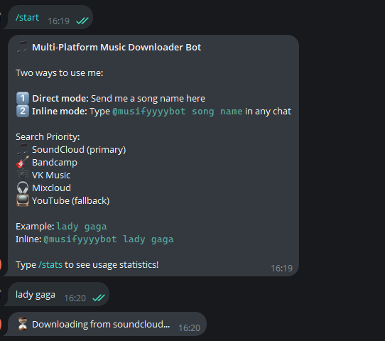
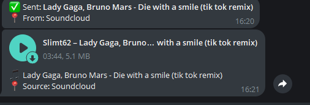

# 🎵 Musifyyy Bot

A powerful Telegram bot for searching and downloading music from multiple platforms including SoundCloud, YouTube, and more. Built with Python and deployed on Render with automated health checks.

[](https://t.me/musifyyybot)
[](https://www.python.org/)
[](LICENSE)

---

## 🌟 Features

- **🔍 Multi-Platform Search**: Search across SoundCloud, YouTube, and other platforms
- **📥 Direct Downloads**: Download high-quality MP3 audio (192kbps)
- **💬 Inline Mode**: Use the bot in any chat with `@musifyyybot song name`
- **📊 Analytics**: Track popular searches, downloads, and platform usage
- **🎯 Smart Search Priority**: 
  - 🎵 SoundCloud (primary)
  - 🎸 Bandcamp
  - 🎼 VK Music
  - 🎧 Mixcloud
  - 📺 YouTube (fallback)
- **⚡ Fast & Reliable**: Optimized with cookies and multiple extraction methods
- **🌐 Webhook Support**: Runs efficiently on cloud platforms

---

## 📸 Screenshots

### Direct Mode - Search Results


### Inline Mode Usage


### Download Complete


### Bot Statistics


---

## 🚀 Quick Start

### Try It Now!
Start chatting with the bot: **[@musifyyybot](https://t.me/musifyyybot)**

### Usage Examples

**Direct Mode:**
```
1. Open chat with @musifyyybot
2. Send a song name: "lady gaga poker face"
3. Choose from search results
4. Download and enjoy!
```

**Inline Mode:**
```
1. In any chat, type: @musifyyybot billie eilish
2. Select a track from the dropdown
3. Track will be sent to the chat
```

**View Statistics:**
```
Send /stats to see:
- Total searches and downloads
- Top queries
- Platform usage breakdown
```

---

## 🛠️ Deployment

### Prerequisites
- Python 3.11+
- Telegram Bot Token (from [@BotFather](https://t.me/botfather))
- Render account (or any cloud platform)
- FFmpeg installed

### Environment Variables

Create a `.env` file or set these in your hosting platform:

```env
BOT_TOKEN=your_telegram_bot_token_here
WEBHOOK_BASE_URL=https://your-app-name.onrender.com
PORT=8080
```

### Deploy on Render

1. **Fork this repository**

2. **Create a new Web Service on Render**
   - Connect your GitHub repository
   - Build Command: `pip install -r requirements.txt`
   - Start Command: `python app.py`

3. **Set Environment Variables**
   - `BOT_TOKEN`: Your Telegram bot token
   - `WEBHOOK_BASE_URL`: Your Render app URL

4. **Add Secrets** (Optional for YouTube)
   - Upload `cookies.txt` in Render secret files at `/etc/secrets/cookies.txt`
   - This enables access to more YouTube content

5. **Deploy!** 🚀

### Keep It Alive (Cron Job)

To prevent Render's free tier from sleeping, set up a cron job to ping your bot:

```bash
# Use cron-job.org or UptimeRobot
# Ping URL: https://your-app-name.onrender.com/webhook
# Interval: Every 10 minutes
```

Or use GitHub Actions:

```yaml
# .github/workflows/ping.yml
name: Keep Alive
on:
  schedule:
    - cron: '*/10 * * * *'  # Every 10 minutes
jobs:
  ping:
    runs-on: ubuntu-latest
    steps:
      - name: Ping Webhook
        run: curl -I https://your-app-name.onrender.com/webhook
```

---

## 💻 Local Development

### Setup

1. **Clone the repository**
   ```bash
   git clone https://github.com/sepehrmoghiseh/musifyyy.git
   cd musifyyy
   ```

2. **Create virtual environment**
   ```bash
   python -m venv .venv
   # Windows
   .venv\Scripts\activate
   # Linux/Mac
   source .venv/bin/activate
   ```

3. **Install dependencies**
   ```bash
   pip install -r requirements.txt
   ```

4. **Set up environment variables**
   ```bash
   # Windows PowerShell
   $env:BOT_TOKEN="your_token_here"
   
   # Linux/Mac
   export BOT_TOKEN=your_token_here
   ```

5. **Run the bot**
   ```bash
   python app.py
   ```

The bot will run in polling mode locally (no webhook needed).

---

## 📦 Dependencies

```
python-telegram-bot[webhooks]==21.6
yt-dlp>=2025.10.01
yt-dlp-youtube-oauth2
```

### System Requirements
- **FFmpeg**: Required for audio conversion
  - Linux: `apt-get install ffmpeg`
  - Windows: Download from [ffmpeg.org](https://ffmpeg.org/download.html)
  - Mac: `brew install ffmpeg`


## 🏗️ Project Structure

```
musifyyy/
├── app.py                 # Main application entry point
├── config/
│   └── settings.py       # Configuration management
├── core/
│   ├── search.py         # Multi-platform search engine
│   ├── downloader.py     # Audio download handler
│   └── analytics.py      # Analytics tracking
├── handlers/
│   ├── commands.py       # Bot command handlers
│   ├── inline.py         # Inline mode handlers
│   └── callbacks.py      # Button callback handlers
├── utils/
│   └── helpers.py        # Utility functions
├── requirements.txt      # Python dependencies
├── Procfile             # Render deployment config
└── README.md            # This file
```

---

## 🤝 Contributing

Contributions are welcome! Here's how you can help:

1. Fork the repository
2. Create a feature branch (`git checkout -b feature/AmazingFeature`)
3. Commit your changes (`git commit -m 'Add some AmazingFeature'`)
4. Push to the branch (`git push origin feature/AmazingFeature`)
5. Open a Pull Request

